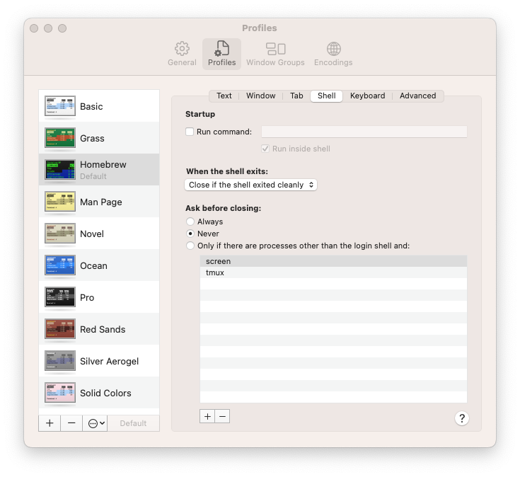

# rn-run

## Description: 

Run react native app on ios or android using a single command. This allows you to quickly run different branches without having to stop any processes or quit any programs, just run the command again on a different branch. Run this script in the root of your react native project.

At this time, you do need to have Xcode opened to your workspace and you may also need to be running your debugger: https://github.com/jhen0409/react-native-debugger. Once these are opened and running you don't need to touch them again.

## Usage: 

`rn-run <option>`

## Options
```
-i: run ios
-I: run ios clean install
-a: run android
```

## Dependencies
This script needs the alias `ipad-mini` to work: https://github.com/nigelrudolf/useful-aliases

## Setup

On MacOS you will need to set **Ask before closing** to **Never** in Terminal settings


## Installation
```
git clone https://github.com/nigelrudolf/rn-run.git ~/Downloads/rn-run

sudo cp ~/Downloads/rn-run/rn-run /usr/local/bin

sudo chmod +x /usr/local/bin/rn-run

Close the shell and start a new one
```